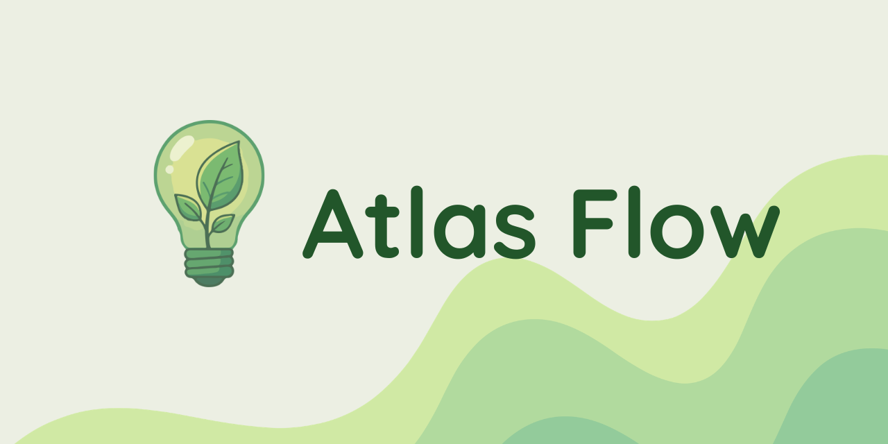

# AtlasFlow

AtlasFlow is a supply-chain sustainability platform designed to help organisations map suppliers, estimate carbon intensity, test decarbonisation scenarios, and produce decision-ready reports.

Built as a polished web application rather than a static prototype, AtlasFlow gives users a working client workspace and a separate admin experience. The result is a product that can be demonstrated, assessed, and used as a practical digital solution.

## Why this project matters

Many organisations know sustainability reporting matters, but they still struggle to answer straightforward operational questions:

- Which suppliers create the biggest emissions risk?
- Where are the highest-value opportunities for improvement?
- How can a team compare possible changes before committing to them?
- How can that information be presented clearly for teachers, assessors, managers, or executives?

AtlasFlow addresses that gap with an interactive workflow:

1. Sign in to a workspace.
2. Build or import a supplier network.
3. Review hotspots and structural risk.
4. Run simulation scenarios.
5. Export executive-ready reporting.

## Product overview

### Client workspace

The client side of AtlasFlow is designed for a sustainability lead, operations analyst, or decision-maker who wants a clear picture of supplier emissions.

Key capabilities include:

- Supplier dashboard with live metrics and risk visibility
- CSV import for supplier records
- Editable supplier cards with carbon intensity, category, region, and notes
- Automatic persistence of supplier changes
- Personal profile and workspace settings

### Network map

The network map turns a list of suppliers into a visual operating picture.

Users can:

- View suppliers as an interactive graph
- Explore proximity and category-based relationships
- Search and filter visible suppliers
- Adjust spacing and presentation options
- Inspect risk levels and supplier details in context

This makes AtlasFlow feel more like a true product dashboard and less like a spreadsheet exercise.

### Simulation studio

The simulation area allows users to test what-if scenarios before making real recommendations.

Users can:

- Adjust supplier intensity values
- Save named scenarios for comparison
- Compare a scenario against the live baseline
- Estimate emissions deltas and projected cost impact
- Capture notes explaining why a scenario matters

This is one of the most useful parts of the product for demonstrating critical thinking and decision support.

### Executive reporting

AtlasFlow includes a reporting experience that transforms live network data into presentation-ready outputs.

Available report types include:

- Carbon Summary
- Supplier Performance
- Compliance Brief

The reporting page highlights:

- total estimated emissions
- high-risk suppliers
- key reduction opportunities
- ranked supplier performance
- exportable CSV evidence tables

This makes it easier for a teacher, assessor, or stakeholder to see the practical value of the system.

### Admin experience

AtlasFlow also includes a dedicated admin interface, separate from the client workspace.

The admin side can be used to:

- review multiple client workspaces
- inspect supplier health across accounts
- monitor risk concentration
- explore compliance-oriented oversight views
- run a read-only simulation view without entering the client workspace directly

This separation gives the project stronger product depth and demonstrates role-based design.

## Built with

AtlasFlow is built using modern web technologies:

- React
- TypeScript
- Vite
- Tailwind CSS
- Supabase
- React Router

## Teacher guide

For marking, classroom review, local setup, and deployment instructions, see [TEACHER-GUIDE.md](./TEACHER-GUIDE.md).

## Final note

AtlasFlow was created to feel like a credible product, not just a classroom mock-up. The interface, workflow, role separation, simulation tooling, and reporting layer were all designed to make the system understandable, demonstrable, and genuinely useful.
